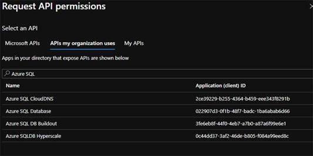
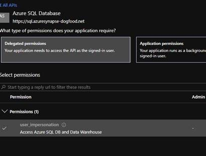

# Calling Azure SQL On Behalf of user in an Azure Active Directory Website (.Net Core 3.1)

This sample shows how to call Azure SQL passing thru the logged in user's credentials (user_impersonation) [aka the [On Behalf Flow](https://docs.microsoft.com/en-us/azure/active-directory/develop/v2-oauth2-on-behalf-of-flow)].  This is the Azure AD versions of Windows Impersonation. This sample is ASP.Net Core 3.1. 

There are 2 different examples:
- Using the older style with ConfidentialClientApplicationBuilder
- The Pre-release version of the new [Microsoft.Identity.Web](https://github.com/AzureAD/microsoft-identity-web) library
  - Need to specify the Conditional Complication symbol:  `newMSAL`
  
## Important Files
- [Startup.cs](WebSite/Startup.cs) - Focus on the block starting with `#if newMSAL`
- [HomeController.cs - Calling SQL](WebSite/Controllers/HomeController.cs)

## Prerequisites
- Register your application as [Azure Active Directory Application](https://docs.microsoft.com/en-us/azure/active-directory/develop/quickstart-register-app)
- For that Azure Application Registration
  - Create an Application ID URI ***[Config (appsettings.config): AzureAd - AppIdUri]***
  - Under Authentication
    - Under Implicit Grant, select "ID tokens"
    - For a Web App, for every deployed version of the app, add a Redirect URI with the pattern of [URL]/signin-oidc.
  - Under Certificates & secrets, create a secret ***[Config (appsettings.config): AzureAd - ClientSecret]***
  - Under API Permissions
    - Add a Permission
      - Search "APIs my organization uses"
        - In the search box, type Azure SQL, select "Azure SQL Database"
  
          - If you don't find it, at least one Azure SQL Db needed to be created in an Azure Subscription that is tied to the Azure AD Tenant 
        - Select "Delegated Permissions" and check "user_impersonation".
   
        - Click "Add Permission"
    - You must then ["Grant admin consent"](https://docs.microsoft.com/en-us/azure/active-directory/manage-apps/grant-admin-consent)
 - AD Users have to be configured in SQL for correct permissions, for example if the users Azure AD Account was user@contoso.com:
   - `CREATE USER [user@contoso.com] FROM EXTERNAL PROVIDER`
   - You can know use user@contoso.com for Role membership and GRANT commands.


## After you clone

- Update the appsettings.config
  - ConnectionString: `"Server=tcp:SOMESERVER.database.windows.net,1433;Initial Catalog=SOMEDB;"`
  - AzureAd section has the various properties of an Azure AD App: 
```json
  "AzureAd": {
    "Instance": "https://login.microsoftonline.com/",
    "Domain": "",
    "TenantId": "",
    "ClientId": "",
    "ClientSecret": "",
    "CallbackPath": "",
    "AppIdUri": ""
  }
```
  
